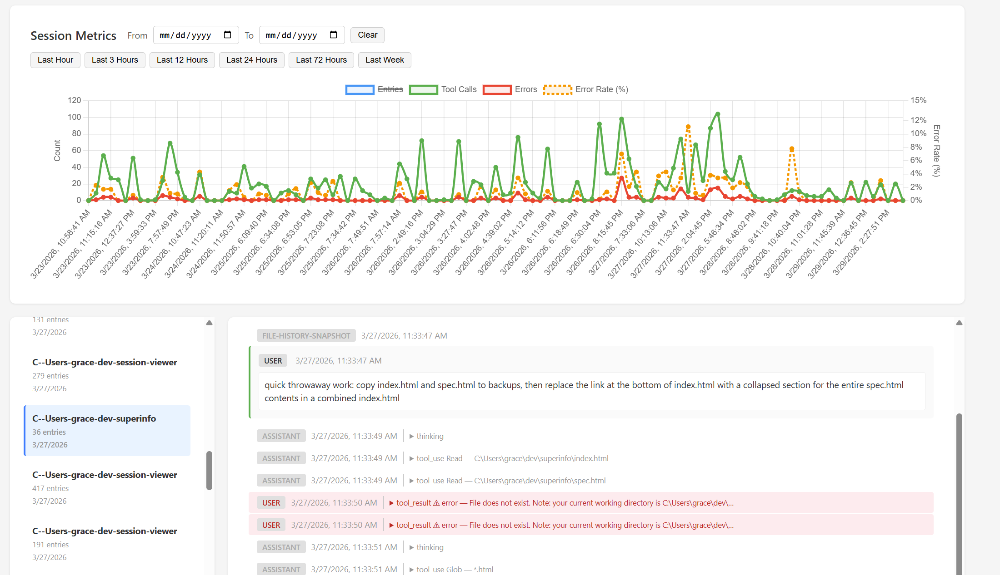

# session-viewer

Browse and inspect your Claude Code sessions in a local web UI.



## Usage

```sh
npx session-viewer
```

Then open [http://localhost:3000](http://localhost:3000).

## What it shows

- **Session Metrics** — chart of tool calls, errors, and error rate across all sessions, with time-range presets (last hour → last week) or custom date filters
- **Session list** — all sessions grouped by project, with entry counts and timestamps
- **Session detail** — summary stats (project, entries, tool calls, errors, CWD), full entry log with collapsible tool use / tool result blocks, and subagent entries

## Configuration

By default, sessions are read from `~/.claude/projects`. To point at a different directory:

```sh
PROJECTS_DIR=/path/to/projects npx session-viewer
```
